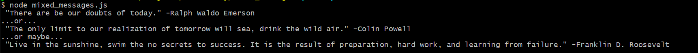

# Mixed Messages
## Codecademy Portfolio Project
Created as part of the Codecademy Full-Stack Career Path.
### ***Goals:***
1. Import a text file with a list of famous quotes.
2. Select single quotes from the list and deconstruct it into 3 parts: the begining of the quote, the end of the quote and the person quoted.
3. Display "confused" quotes that combine parts of different quotes.

### ***Resources:***
1. Programmed in Javascript.
2. Text file import via Node.js fs module.
3. Git version control.
4. Coded in VS Code

## Running the program
This project was created to be run on the terminal using Node.js. Outputs three "confused" quotes to the terminal made from different parts of three randomly chosen real quotes.
